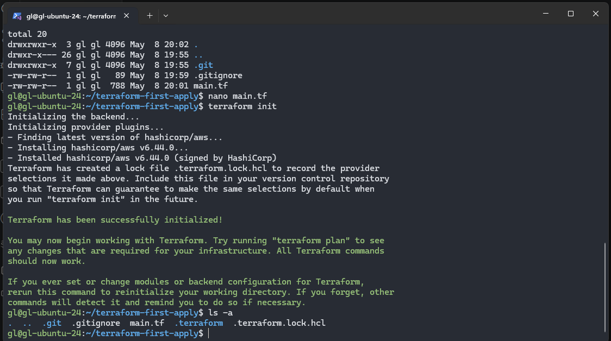
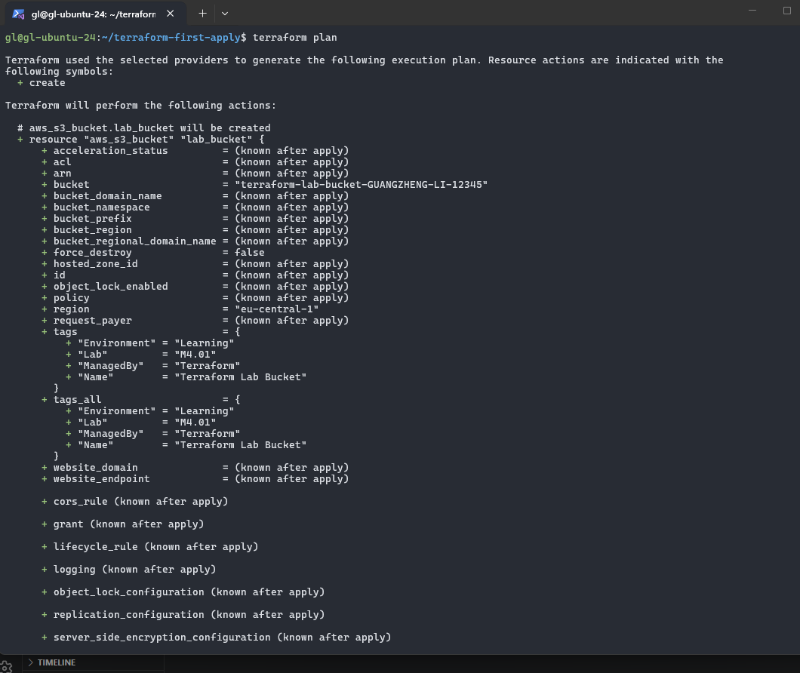
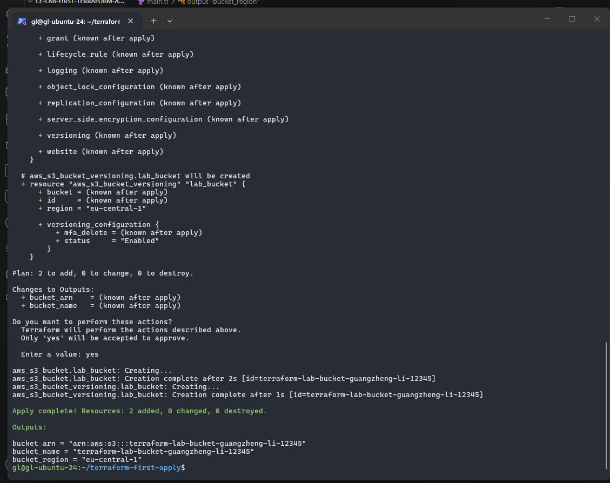
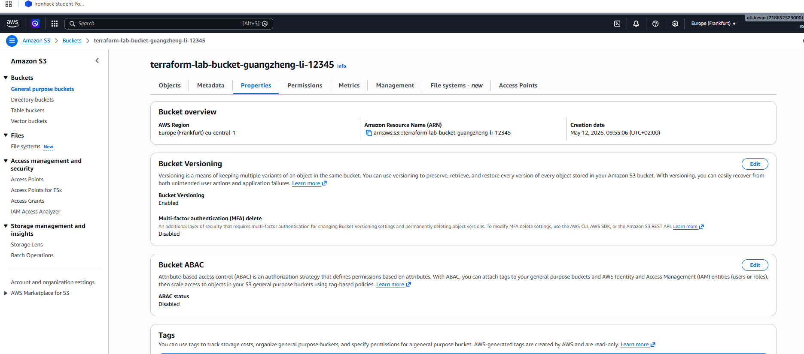
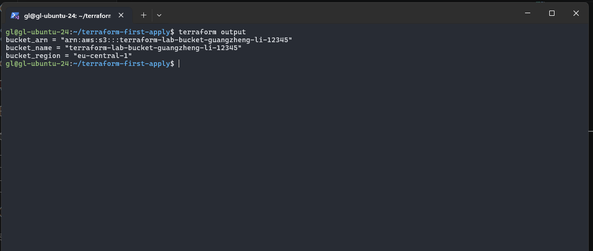
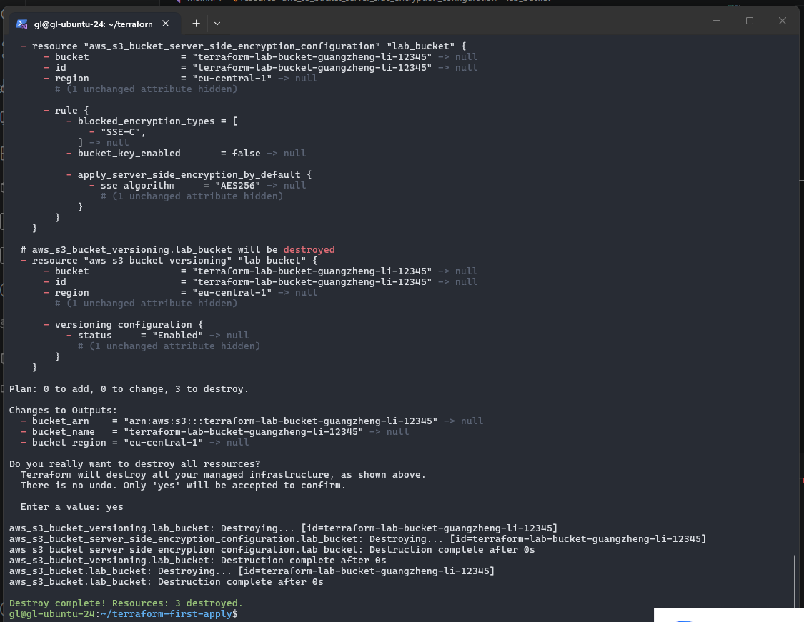

# Lab M4.01 — First Terraform Apply

## 🎯 Lab Objectives Completed
- Set up a new Terraform project from scratch.
- Configured the AWS Provider.
- Defined and deployed an S3 bucket with versioning and server-side encryption.
- Mastered the Terraform workflow: `init`, `plan`, `apply`, and `destroy`.
- Explored the Terraform State file (`.tfstate`).

## 🛠️ Resources Created
| Resource Name | Type | Purpose |
|---|---|---|
| `aws_s3_bucket` | S3 Bucket | Global storage for objects. |
| `aws_s3_bucket_versioning` | S3 Bucket Feature | Maintains multiple versions of objects. |
| `aws_s3_bucket_server_side_encryption_configuration` | S3 Bucket Feature | Enforces AES256 encryption for data at rest. |

## 💻 Commands Executed
1. `terraform init`: Initialized the backend and downloaded providers.
2. `terraform fmt`: Formatted code for consistency.
3. `terraform validate`: Checked syntax and configuration logic.
4. `terraform plan`: Previewed infrastructure changes.
5. `terraform apply`: Provisioned resources in AWS.
6. `terraform state list`: Viewed resources tracked in the state file.
7. `terraform destroy`: Safely removed all resources.

## 🚀 Challenges Faced & Solutions
- **Challenge: Time Drift Error.** 
  - *Symptom:* Received `SignatureDoesNotMatch` / `Signature expired` during `terraform plan`.
  - *Solution:* The Ubuntu VM system clock was out of sync with AWS. I used `ntpdate` and `systemctl restart systemd-timesyncd` to synchronize the clock with global NTP servers.
- **Challenge: Globally Unique Bucket Name.**
  - *Symptom:* S3 names must be unique across all AWS accounts.
  - *Solution:* Appended a unique string of initials and random numbers to the bucket name.

## 🧠 Key Learnings
- **Declarative vs. Imperative:** I learned that I just need to describe the "Final State" in code, and Terraform handles the "How" to get there.
- **The Power of State:** The `.tfstate` file is the source of truth that maps code to real-world resources.
- **Idempotency:** Running `apply` multiple times with the same code results in no extra changes unless the code is modified.

## 📸 Screenshots
### 01 - Terraform Init

### 02 - Terraform Plan

### 03 - Terraform Apply Success

### 04 - AWS Console Verification

### 05 - Terraform Outputs

### 06 - Terraform Destroy
